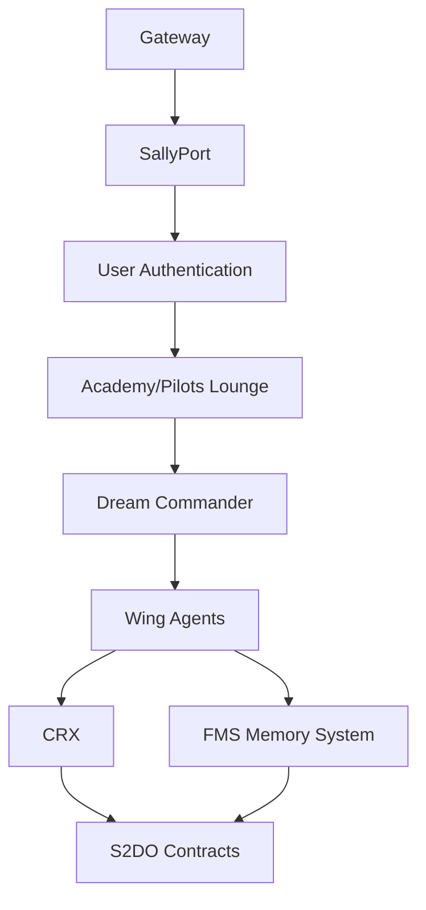
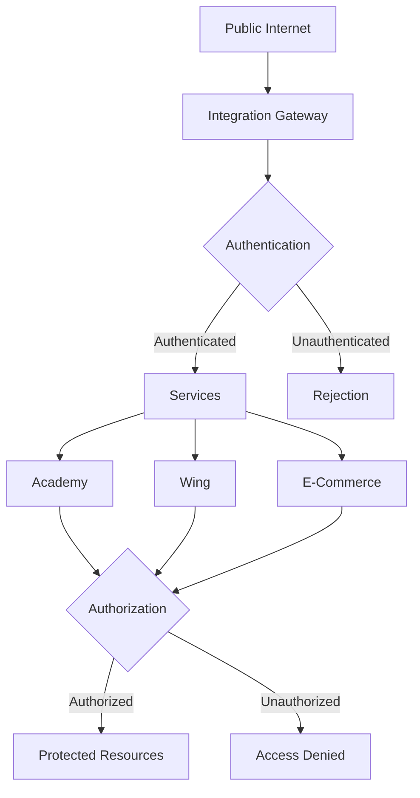

# Aixtiv Symphony Status Map

## Overview
This document provides a comprehensive status view of all major Aixtiv Symphony components, using visual indicators ("tombstones") and structured YAML representations for easy status assessment.

## Status Legend
- ✅ OPERATIONAL - Component is fully functional
- 🔄 CONFIGURING - Component is being set up or updated
- ⚠️ DEGRADED - Component is operational but with issues
- ❌ OFFLINE - Component is not operational

## Core Infrastructure

### Integration Gateway 🔄
```yaml
API Gateway:
  Name: aixtiv-gateway-api
  Region: us-west1
  Endpoints: 
    - /auth (✅ ACTIVE)
    - /orchestration (🔄 DEPLOYING)
    - /agents (✅ ACTIVE)
    - /metrics (⚠️ PARTIAL)
  Security:
    JWT Verification: ENABLED
    Role Validation: ENABLED
    Subscription Check: CONFIGURING
  Status: Partially operational, authentication routes working
```

### SallyPort Security 🔄
```yaml
Components:
  SallyPort Verifier: 
    Version: 1.0.1
    Status: ACTIVE
  Dr. Grant Authenticator:
    Version: 0.9.2
    Status: BETA
  Token Management:
    Refresh Strategy: HIERARCHICAL
    Expiration: 24h
    Status: ACTIVE
Issues:
  - Role propagation delay (12s)
  - Token refresh race condition
Remediation:
  - PR#324 (Pending Review)
  - Issue#129 (In Progress)
```

## VLS (Vision Lake Solutions)

### Dr. Lucy Flight Memory System ✅
```yaml
Database:
  Name: fms-firestore
  Collections:
    - flight-records (✅)
    - memory-blocks (✅)
    - context-chains (✅)
  Indexes: OPTIMIZED
Services:
  Persistence Layer:
    Status: ACTIVE
    Latency: 42ms
  Query Engine:
    Status: ACTIVE
    Cache Hit Rate: 87%
  Integration Points: 
    - Wing (✅)
    - Academy (✅)
    - Dr. Claude (✅)
```

### Dr. Burby S2DO Blockchain ⚠️
```yaml
Chain:
  Type: Polygon sidechain
  Status: ACTIVE
  Block Time: 6s
Smart Contracts:
  - S2DORegistry (✅)
  - ApprovalValidator (✅)
  - TokenManager (⚠️ GAS ISSUES)
Integration:
  Status: DEGRADED
  Issues:
    - Retry mechanism failing
    - Gas estimation inaccurate
  Remediation:
    PR#287: Gas optimization in progress
```

### Professor Lee Q4D Lenz ❌
```yaml
Engine:
  Status: OFFLINE
  Last Working: 2025-05-22
Resources:
  Memory Allocation: EXCESSIVE
  Database Connection: TIMEOUT
Error:
  Code: QL-5503
  Description: Vector index corruption
Remediation:
  - Reset vector database (SCHEDULED)
  - Patch deployment (PENDING QA)
```

### Dr. Sabina Dream Commander ✅
```yaml
Model:
  Type: Hybrid ML/Rule-based
  Status: OPERATIONAL
  Accuracy: 94.2%
Features:
  Path Prediction: ENABLED
  User Profiling: ENABLED
  Real-time Adaptation: ENABLED
Integration Points:
  - Academy (✅)
  - User Dashboard (✅)
  - Analytics Engine (✅)
```

## Wing (Agent Orchestration)

### Core Agency (R1 Squadron) ✅
```yaml
Deployment:
  Name: r1-squadron-deployment
  Region: us-west1-b
  Replicas: 3/3
  Status: OPERATIONAL
Agents:
  Active: 42
  Idle: 7
  Failed: 0
Performance:
  Response Time: 212ms
  Success Rate: 99.8%
  Uptime: 14d 7h 23m
```

### Deploy Agency (R2 Squadron) 🔄
```yaml
Deployment:
  Name: r2-squadron-deployment
  Region: us-west1-b
  Replicas: 2/4
  Status: SCALING
Agents:
  Active: 16
  Idle: 3
  Failed: 1
Performance:
  Response Time: 348ms
  Success Rate: 97.2%
  Issues:
    - Agent Initialization Lag
    - Memory Allocation Warnings
```

### RIX Agents ⚠️
```yaml
Deployment:
  Name: rix-gold-standard
  Version: 5.4.5.6
  Status: DEGRADED
Performance:
  Response Quality: 97.4%
  Timeout Rate: 4.8%
  Query Processing: 2.3s
Issues:
  - Context window limitations
  - Token consumption spikes
Remediation:
  PR#451: Context optimization
```

## Academy

### Frontend 🔄
```yaml
Deployment:
  Name: academy-frontend
  Environment: Production
  Version: 1.2.3
  Status: CONFIGURING
Components:
  - Learning Dashboard (✅)
  - Assessment Engine (✅)
  - Video Integration (🔄)
  - Progress Tracking (⚠️)
Issues:
  - Daily Integration video stream buffering
  - Progress sync delays with FMS
Remediation:
  - Video CDN configuration in progress
  - Database indexing optimization scheduled
```

### Backend ✅
```yaml
Services:
  API Gateway:
    Status: OPERATIONAL
    Endpoints: 17/17 ACTIVE
  Session Management:
    Status: OPERATIONAL
    Active Users: 1,287
  Assessment Engine:
    Status: OPERATIONAL
    Response Time: 186ms
Integration:
  - Auth System (✅)
  - Content Delivery (✅)
  - Dream Commander (✅)
  - Analytics Pipeline (✅)
```

## Blockchain Infrastructure

### Wallets ⚠️
```yaml
Owner Subscriber:
  Status: DEGRADED
  Issues: Slow transaction signing
Corporate:
  Status: OPERATIONAL
  Features: All enabled
Integration:
  Status: DEGRADED
  Issues:
    - Cross-chain bridge timeout
    - Gas estimation errors
Remediation:
  - Provider fallback implementation
  - Transaction queue optimization
```

### NFT System ✅
```yaml
Collections:
  Progenesis:
    Status: ACTIVE
    Items: 1,247
    Mint Rate: 12/day
  Achievement:
    Status: ACTIVE
    Items: 3,842
    Issuance: Automated
Marketplaces:
  Internal:
    Status: OPERATIONAL
    Volume: 87 NFTs/day
  External:
    Status: OPERATIONAL
    Integrations: 3/3
```

## E-Commerce

### Storefront ✅
```yaml
Deployment:
  Name: ecommerce-storefront
  Environment: Production
  Status: OPERATIONAL
Components:
  Product Catalog: SYNCED
  Cart System: OPERATIONAL
  Checkout Flow: OPERATIONAL
  Payment Processing: OPERATIONAL
Performance:
  Page Load: 1.2s
  Conversion Rate: 4.7%
  Uptime: 99.98%
```

### Payment Processing 🔄
```yaml
Providers:
  - Stripe (✅ ACTIVE)
  - PayPal (✅ ACTIVE)
  - Crypto (🔄 CONFIGURING)
Integration:
  Status: CONFIGURING
  Issues:
    - Webhook reliability for crypto payments
    - Settlement confirmation delays
Remediation:
  - Implementing retry mechanism
  - Adding confirmation caching
```

## Component Relationships

### Primary Data Flow


### Security Boundary Map


## Verification Commands

### Integration Gateway
```bash
# API Status
curl -I https://gateway.asoos-2100.com/health

# JWT Verification
curl -H "Authorization: Bearer ${TOKEN}" https://gateway.asoos-2100.com/auth/verify

# Route Availability
for route in auth orchestration agents metrics; do
  curl -I https://gateway.asoos-2100.com/$route
done
```

### VLS Components
```bash
# FMS Status
gcloud firestore collections list --database=fms-firestore

# S2DO Contract Status
cast call 0x742d35Cc6634C0532925a3b844Bc454e4438f44e "isActive()" --rpc-url https://polygon-mumbai.infura.io/v3/${INFURA_KEY}

# Dream Commander
curl -X POST https://dream-commander.asoos-2100.com/api/health-check -H "Content-Type: application/json" -d '{"check_type": "full"}'
```

### Wing Agents
```bash
# Squadron Status
kubectl get deployments -n wing-system

# Agent Status
curl https://wing-api.asoos-2100.com/api/agents/status -H "Authorization: Bearer ${TOKEN}"

# Performance Metrics
gcloud monitoring metrics list --filter="metric.type=custom.googleapis.com/wing/agent_performance"
```

### Academy
```bash
# Frontend Status
curl -I https://academy.asoos-2100.com

# Backend API
curl https://academy-api.asoos-2100.com/api/health

# Content Delivery
curl https://academy-cdn.asoos-2100.com/status
```

---

## Maintenance Contact
- Technical Lead: Symphony Operations (ops@asoos-2100.com)
- Status Dashboard: https://status.asoos-2100.com
- Repository: github.com/aixtiv/symphony-status

